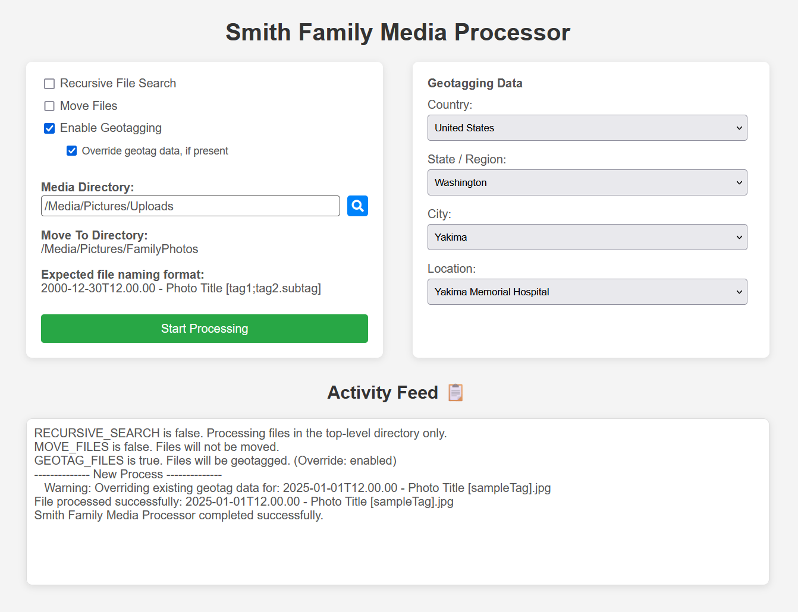

# Family Media Processor

I was facing multiple challenges with organizing my family photos and videos:

-   Inconsistent dates, even within the same file
-   Limited functionality of existing geotagging software
-   Difficulty setting correct metadata fields for photo organizers like Immich
-   Desire for consistent file naming conventions and automated file organization

To address these issues, I developed the `Family Media Processor` application to streamline and automate the process of cleaning and organizing our family media collection.

This Flask-based, Docker-deployable application automates setting metadata, geotagging, and media organization based on user defined settings. It works by extracting dates/times, titles, and tags directly from file names, applying them to the corresponding metadata fields to ensure consistency. Geotagging is managed through dropdowns in the user interface and a configurable config data file. And if enabled, files will also be moved in the desired directory and organized by year and month.

Dashboard


Media Directory Selector


## Table of Contents

- [Project Structure](#project-structure)
- [Functionality Overview](#functionality-overview)
  - [Photo Processing](#photo-processing)
  - [User Interface Options](#user-interface-options)
- [Docker Setup](#docker-setup)
- [Configuration](#configuration)
  - [Environment Variables](#environment-variables)
  - [Volumes](#volumes)
  - [Geotag Data File](#geotag-data-file)
- [Troubleshooting](#troubleshooting)
- [License](#license)

## Project Structure

- `docker/app.py`: The main Python application handling the backend, including geotag data retrieval and file processing logic.
- `docker/templates/index.html`: The HTML file for the web interface.
- `config/sample_geotag_data.yaml`: Config YAML file with geotagging data.
- `screenshots/`: Directory containing project screenshots.
- `Dockerfile`: The Docker configuration to build and run the application.
- `README.md`: Documentation for the project.

## Functionality Overview

### Photo Processing

Clicking the **Process Photos** button initiates the following processing logic on the media files in the `/media` directory:

-   **File Deletion**: Deletes files specified in `FILES_TO_DELETE` list (e.g., system-generated files).

-   **File Extension Cleanup**: Cleans and converts file extensions for consistency (e.g., `.jpeg` to `.jpg`).

-   **File Name Parsing**: Extracts metadata such as date, time, title, and tags from file names, ensuring they follow a specific format.

-   **Metadata Update**: 

    -   **Date/Time**: Sets all date and time fields to the date and time extracted from the file name.
    
    -   **Title**: Sets all title fields (Title, Description, ObjectName, etc.) to the title extracted from the filename.

    -   **Author, Copyright**: Sets all author and copyright fields to the family name.
    
    -   **Tags**: Structured tags (if present in the file name) are extracted and saved as hierarchical tags in various metadata fields.

    -   **Ratings**: All ratings related fields are cleared/deleted.
    
    -   **Geotagging**: If enabled on the user interface, sets GPS coordinates and location details such as city, state, and country in the various metadata fields.
    
    -   **Metadata Cleanup**: Clears unneeded metadata fields.

-   **File Organization**: If enabled, files will be moved them into a target directory and organized by year and month.

### User Interface Options

- **Recursive File Search**
Enabling recursive search will process media files within the `/media` directory and all sub-directories as well. If disabled, sub-directories will be ignored.

- **Move Files**
If enabled, files will be moved them into the `/moveTo` directory and organized by year and month. Otherwise, the field will be processed, but remained in the `/media` directory.

- **Geotagging**
When a user enables geotagging in the user interface, the geotagging section on the right allows the user to select a location for the files being processed. The application retrieves the available geotag options dynamically based on the geotag data config. 

  - **Country**: The country where the file is associated with.
  - **State/Region**: The state or region where the file is associated with.
  - **City**: The city where the file is associated with.
  - **Location**: The specific location or place within the city.

  The selected values are then set to the correct gps metadata fields. The user is also given an option to override existing gps and location metadata fields in the files if they already exist. If the override is not enabled, these fields will not be modified and a warning will be displayed in the logs.


## Docker Setup

To quickly set up and run the application with Docker, you can use the provided `docker-compose.yml` configuration. This will automatically build the image, configure the environment, and start the application.

1. **Clone the repository** and navigate to the project directory:

    ```bash
    git clone https://github.com/davidlcassidy/family-media-processor.git
    cd family-media-processor
    ```

2. **Set up Docker Compose**:

   Ensure your `docker-compose.yml` is in the root directory of the project, then adjust and use the following Docker Compose configuration. More details on the environment variables and volumes are in the following sections.

    ```yaml
    services:
        media-processor:
            build:
                context: /family-media-processor/docker
                dockerfile: Dockerfile
            container_name: family-media-processor
            image: family-media-processor:latest
            environment:
                - APP_NAME=Smith Family Media Processor
                - FAMILY_LAST_NAME=Smith
                - GEOTAG_DATA_FILE=/config/geotag_data.yaml
                - EXTERNAL_MEDIA_DIR=/family-media-processor/Uploads
                - EXTERNAL_MOVE_TO_DIR=/family-media-processor/FamilyPhotos
                - EXCLUDED_DIRECTORIES='@eaDir'
                - FILES_TO_DELETE=Thumbs.db,.DS_Store
                - TZ=America/New_York
                - ENABLE_MOVE_FILES=true
            volumes:
                - /family-media-processor/Uploads:/media
                - /family-media-processor/FamilyPhotos:/moveTo
                - /family-media-processor/docker/config:/config
            ports:
                - 8888:5000
            restart: unless-stopped
    ```

3. **Start the application using Docker Compose**:

    Run the following command in the same directory as your `docker-compose.yml` file:

    ```bash
    docker-compose up --build
    ```
    This will build the image and start the container. The application will be accessible at: 
`http://127.0.0.1:8888`.

4. **Access the application**:

    Open a web browser and navigate to `http://127.0.0.1:8888` to access the Family Media Processor.

## Configuration

### Environment Variables

The application requires the following environment variables, which can be configured in a `.env` file or set manually:

- **APP_NAME** (Optional) :
Name to display at the top of the web interface
Default: "{FAMILY_LAST_NAME} Family Media Processor"

- **FAMILY_LAST_NAME**: 
Last name used for some of the exif data fields.
Default: "Smith"
 
- **GEOTAG_DATA_FILE**: 
Path to the geotagging data file
Default: "./config/geotag_data.yaml"

- **EXTERNAL_MEDIA_DIR** (Optional, but recommended) : 
External path to the mounted /media directory containing files to process.

- **EXTERNAL_MOVE_TO_DIR** (Optional) : 
External path to the mounted /moveTo directory where files can be moved after processing - only use in UI for user information. 

- **EXCLUDED_DIRECTORIES** (Optional) :  
Comma-separated list of directory names that will be excluded (hidden) from the folder selection in the directory selector.

- **FILES_TO_DELETE** (Optional) :  
Comma-separated list of file names. The corresponding files will be deleted during the photo processing.

- **TZ**: 
Timezone for the container (e.g., `America/New_York`)
Default: "GMT"

- **VERBOSE_LOGGING** (Optional) : 
Set to `true` for more detailed logs
Default: false

### Volumes

This application requires three main volumes to function correctly. These are configured in `docker-compose.yml`:

- **Media Directory (`/media`)**  
Stores the media files that need processing.

- **Move To Directory (`/moveTo`)**  
If file moving is enabled, processed files are moved to this directory and organized by year and month.

- **Config Directory (`/config`)**  
Stores configuration files, such as the geotagging data file (`geotag_data.yaml`).

### Geotag Data File

A geotaging data config file is required for the geotaging feature. This config file is expected in the following format.

```yaml
Country Name - Country Code:
  State / Region:
    City:
      Location Name: "latitude, longitude"
```

A sample config file is included in the project.
Note: Country codes should be in [ISO 3166-1 alpha-2](https://en.wikipedia.org/wiki/ISO_3166-1_alpha-2#Officially_assigned_code_elements) format

## Troubleshooting

- If geotagging data is not loading or the dropdowns are empty, verify that the `GEOTAG_DATA_SOURCE` is correctly configured to point to a valid JSON file containing geotagging data.

## License

This project is licensed under the GNU GPLv3 License - see the [LICENSE](LICENSE) file for details.
